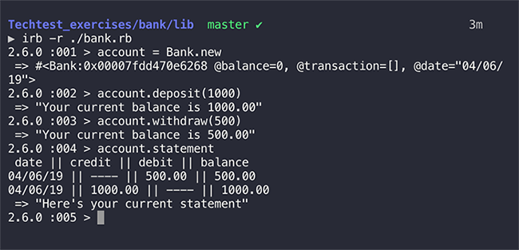

# Bank tech test

How to run
----

1. Clone this repo
2. Run bundle install
3. Run `irb -r ./lib/bank.rb`
4. Good to go!


How to use
----
1. Type `account = Bank.new` to create an account
2. Type `account.deposit(1000)` to deposit 1000.00
3. Type `account.withdraw(500)` to withdraw 500.00
4. Type `account.statement` to see your account statement



How to run the test
----
1. Type `rspec` to check test coverage
2. Type `rubocop` to check formatting


## Specification

### Requirements

* You should be able to interact with your code via a REPL like IRB or the JavaScript console.  (You don't need to implement a command line interface that takes input from STDIN.)
* Deposits, withdrawal.
* Account statement (date, amount, balance) printing.
* Data can be kept in memory (it doesn't need to be stored to a database or anything).

### Acceptance criteria

**Given** a client makes a deposit of 1000 on 10-01-2012  
**And** a deposit of 2000 on 13-01-2012  
**And** a withdrawal of 500 on 14-01-2012  
**When** she prints her bank statement  
**Then** she would see

```
date || credit || debit || balance
14/01/2012 || || 500.00 || 2500.00
13/01/2012 || 2000.00 || || 3000.00
10/01/2012 || 1000.00 || || 1000.00
```
